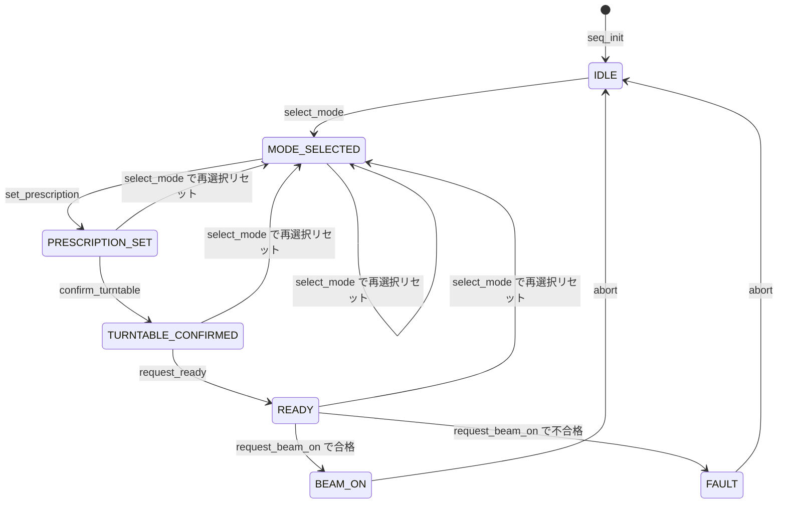

# ソフトウェア詳細設計書(SDD)

**ドキュメント ID:** SDD-TH25S-001
**バージョン:** 1.2
**作成日:** 2026-05-12(初版)/ 2026-05-20(v1.1・v1.2 改訂)
**対象製品:** 仮想 Therac-25 Simple / TH25S-SIM-001
**対象ソフトウェアバージョン:** 1.0.0
**安全クラス:** C(IEC 62304)

| 役割 | 氏名 | 所属 | 日付 | 署名 |
|------|------|------|------|------|
| 作成者 | 開発者A(全ロール兼任) | 学習プロジェクト | 2026-05-20 | — |
| レビュー者 | 開発者A(全ロール兼任) | 学習プロジェクト | 2026-05-20 | — |
| 承認者 | 開発者A(全ロール兼任) | 学習プロジェクト | 2026-05-20 | — |

---

## 1. 目的と適用範囲

本書は、ソフトウェアアーキテクチャ設計書(SAD-TH25S-001)で定義されたソフトウェア項目 ARCH-001 を IEC 62304 箇条 5.4 に従ってソフトウェアユニットへ分解し、各ユニットの詳細設計を定義する。

## 2. 参照文書

| ID | 文書名 | バージョン |
|----|--------|----------|
| [1] | ソフトウェア要求仕様書(SRS-TH25S-001) | 1.0 |
| [2] | ソフトウェアアーキテクチャ設計書(SAD-TH25S-001) | 1.0 |

## 3. ソフトウェア項目のソフトウェアユニットへの改良(箇条 5.4.1)

### 3.1 ユニット階層
```
ARCH-001  TH25S-CORE 安全コア
├── UNIT-001  CommonTypes        (common_types.h / common_types.c)
├── UNIT-002  TreatmentSequencer (treatment_sequencer.h / treatment_sequencer.c)
└── UNIT-003  SafetyInterlock    (safety_interlock.h / safety_interlock.c)
```

### 3.2 ユニット一覧
| ユニット ID | 名称 | 所属項目 | 安全クラス | 概要 |
|------------|------|---------|----------|------|
| UNIT-001 | CommonTypes | ARCH-001 | C | 共通型・モード別範囲検証・飽和カウンタ・エラーメッセージ |
| UNIT-002 | TreatmentSequencer | ARCH-001 | C | 治療シーケンス状態機械。操作順序の構造的強制 |
| UNIT-003 | SafetyInterlock | ARCH-001 | C | ビーム照射可否の独立した最終整合性判定(純関数) |

## 4. ソフトウェアユニットの詳細設計(箇条 5.4.2 ― クラス C)

### UNIT-001: CommonTypes

- **目的 / 責務:** 全ユニットが共有する型・定数・検証関数・飽和カウンタ・エラーメッセージを提供する。
- **関連 SRS:** SRS-005, SRS-008, SRS-009, SRS-010 / **関連 RCM:** RCM-003, RCM-004 / **安全クラス:** C

#### 公開 API
| 関数 | 引数 | 戻り値 | 事前条件 | 事後条件 / エラー処理 |
|------|------|-------|---------|----------------------|
| `th25s_error_message` | `th25s_error_t code` | `const char *` | なし | 非 NULL の文字列を返す。未定義コードは「未定義のエラーコード」を返す(RCM-004) |
| `th25s_validate_energy` | `th25s_treatment_mode_t mode, double energy` | `th25s_error_t` | なし | 電子: [1.0,25.0] MeV / X線: [5.0,25.0] MV を満たせば OK。範囲外は ENERGY_OUT_OF_RANGE。NONE は MODE_NONE |
| `th25s_validate_dose` | `double dose_cgy` | `th25s_error_t` | なし | [0.01,10000.0] cGy を満たせば OK。範囲外は DOSE_OUT_OF_RANGE |
| `th25s_safe_counter_init` | `th25s_safe_counter_t *counter, uint32_t limit` | `void` | なし | counter が NULL なら何もしない。value=0, limit=limit, overflowed=false |
| `th25s_safe_counter_increment` | `th25s_safe_counter_t *counter` | `th25s_error_t` | なし | NULL は NULL_ARG。value<limit なら +1 して OK。value>=limit なら値を保持し overflowed=true、COUNTER_OVERFLOW を返す |
| `th25s_safe_counter_is_valid` | `const th25s_safe_counter_t *counter` | `bool` | なし | NULL または overflowed なら false、それ以外 true |

#### 関数の責務と引数

各関数の役割(責務)と引数・戻り値の意味を示す(正本は `common_types.h` の関数コメント)。

- **`th25s_error_message`** — エラーコードを人間可読の日本語メッセージ文字列に変換する(RCM-004: 暗号的エラー表示の排除)。
  - `code`: 変換対象のエラーコード。
  - 戻り値: 対応する説明文字列(**非 NULL 保証**。未定義コードは既定の「未定義のエラーコード」)。
- **`th25s_validate_energy`** — 治療モードに応じたエネルギ許容範囲を検証する(SRS-005)。許容範囲はモードで異なる。
  - `mode`: 治療モード(電子 / X線)。
  - `energy`: 検証対象のエネルギ値(電子モードは MeV、X線モードは MV)。
  - 戻り値: 範囲内なら `TH25S_OK`、範囲外は `ENERGY_OUT_OF_RANGE`、`NONE` は `MODE_NONE`。
- **`th25s_validate_dose`** — 線量が許容範囲内かを検証する(SRS-008)。
  - `dose_cgy`: 検証対象の線量(cGy 単位)。
  - 戻り値: 範囲内なら `TH25S_OK`、範囲外は `DOSE_OUT_OF_RANGE`。
- **`th25s_safe_counter_init`** — 飽和カウンタを初期値(value=0)に初期化する。使用前に必ず呼ぶ。
  - `counter`: 初期化対象のカウンタ(NULL なら何もしない)。
  - `limit`: カウンタの上限値(これ以上は飽和してオーバーフロー扱い)。
- **`th25s_safe_counter_increment`** — 飽和カウンタを 1 増やす。上限到達時は 0 へ巻き戻さずオーバーフロー扱いにする(RCM-003: HZ-003 のカウンタ巻き戻りバイパスを構造的に排除)。
  - `counter`: 対象カウンタ。
  - 戻り値: 成功で `TH25S_OK`、NULL で `NULL_ARG`、上限到達で値を保持し `COUNTER_OVERFLOW`。
- **`th25s_safe_counter_is_valid`** — カウンタがオーバーフローしておらず安全に使える状態かを返す。
  - `counter`: 対象カウンタ。
  - 戻り値: 未オーバーフローで `true`、NULL またはオーバーフロー済みで `false`。

#### データ構造
| 名称 | 型 | 値域 | 意味 |
|------|---|------|------|
| `th25s_treatment_mode_t` | enum | NONE / ELECTRON / XRAY | 治療モード |
| `th25s_turntable_position_t` | enum | UNKNOWN / FIELD_LIGHT_POS / ELECTRON_POS / XRAY_POS | ターンテーブル位置 |
| `th25s_error_t` | enum | OK 他 9 種 | エラーコード体系 |
| `th25s_prescription_t` | struct | mode, energy, dose_cgy | 処方 |
| `th25s_safe_counter_t` | struct | value, limit, overflowed | 飽和カウンタ |

#### アルゴリズム(飽和カウンタ ― RCM-003)
```
th25s_safe_counter_increment(counter):
    if counter == NULL: return NULL_ARG
    if counter->value >= counter->limit:
        counter->overflowed = true
        return COUNTER_OVERFLOW          # 0 へ巻き戻さない(Therac-25 の 8bit カウンタとの対比)
    counter->value += 1
    return OK
```

#### 例外・異常系の扱い
| 異常条件 | 検出方法 | 処置 |
|---------|---------|------|
| counter が NULL | 関数冒頭の NULL チェック | increment は NULL_ARG、is_valid は false、init は無処理 |
| エネルギ・線量が範囲外 | 定数との比較 | 対応する OUT_OF_RANGE コードを返す |
| カウンタ上限到達 | value >= limit の比較 | overflowed を立て COUNTER_OVERFLOW を返す(巻き戻さない) |

---

### UNIT-002: TreatmentSequencer

- **目的 / 責務:** 操作者の治療操作を受け、明示的状態機械により操作順序を構造的に強制する。ビームオン時に UNIT-003 を呼んで最終判定する。
- **関連 SRS:** SRS-001〜004, SRS-006, SRS-009, SRS-101 / **関連 RCM:** RCM-001, RCM-003 / **安全クラス:** C

#### 公開 API
| 関数 | 引数 | 戻り値 | 事前条件 | 事後条件 / エラー処理 |
|------|------|-------|---------|----------------------|
| `th25s_seq_init` | `th25s_sequencer_t *seq` | `void` | なし | state=IDLE、処方クリア、turntable=UNKNOWN、カウンタ初期化 |
| `th25s_seq_state` | `const th25s_sequencer_t *seq` | `th25s_seq_state_t` | なし | NULL は FAULT を返す |
| `th25s_seq_select_mode` | `th25s_sequencer_t *seq, th25s_treatment_mode_t mode` | `th25s_error_t` | seq 非 NULL、mode != NONE、state ∈ {IDLE..READY} | 処方・turntable を破棄し state=MODE_SELECTED。BEAM_ON/FAULT では SEQUENCE_VIOLATION(RCM-001) |
| `th25s_seq_set_prescription` | `th25s_sequencer_t *seq, th25s_prescription_t rx` | `th25s_error_t` | state=MODE_SELECTED、rx.mode=選択モード、範囲内 | state=PRESCRIPTION_SET。違反は SEQUENCE_VIOLATION / OUT_OF_RANGE |
| `th25s_seq_confirm_turntable` | `th25s_sequencer_t *seq, th25s_turntable_position_t pos` | `th25s_error_t` | state=PRESCRIPTION_SET、pos != UNKNOWN | state=TURNTABLE_CONFIRMED。違反は SEQUENCE_VIOLATION / TURNTABLE_NOT_CONFIRMED |
| `th25s_seq_request_ready` | `th25s_sequencer_t *seq` | `th25s_error_t` | state=TURNTABLE_CONFIRMED | state=READY。違反は SEQUENCE_VIOLATION |
| `th25s_seq_request_beam_on` | `th25s_sequencer_t *seq` | `th25s_error_t` | state=READY | カウンタ +1 → UNIT-003 判定 → OK なら BEAM_ON。違反/不合格は FAULT へ遷移し対応エラー |
| `th25s_seq_abort` | `th25s_sequencer_t *seq` | `void` | なし | state=IDLE、処方クリア。カウンタは生涯値として保持 |

#### 関数の責務と引数

各関数の役割(責務)と引数・戻り値の意味を示す(正本は `treatment_sequencer.h` の関数コメント)。本ユニットは「操作を受け付ける窓口」であると同時に、状態機械により**操作順序そのものを安全機構として機能させる**(RCM-001)。

- **`th25s_seq_init`** — 治療シーケンサを初期状態(IDLE)にする。1 件の治療を始める前に必ず呼ぶ。
  - `seq`: 初期化対象のシーケンサ。
- **`th25s_seq_state`** — シーケンサの現在の状態を取得する(試験や UI 表示のための観測手段)。
  - `seq`: 対象シーケンサ。NULL の場合は安全側に倒して `FAULT` を返す。
  - 戻り値: 現在の状態。
- **`th25s_seq_select_mode`** — 治療モードを選択する。**RCM-001 の中核**: IDLE〜READY のどこから呼んでも処方・ターンテーブル確定を破棄して MODE_SELECTED へ戻し、「モード編集後に古い機構状態のままビームオン」(Therac-25 型バグ)を構造的に防ぐ。
  - `seq`: 対象シーケンサ。
  - `mode`: 選択する治療モード(電子 / X線。`NONE` は `MODE_NONE` で拒否)。
  - 戻り値: 成功で `TH25S_OK`、BEAM_ON / FAULT 中は `SEQUENCE_VIOLATION`。
- **`th25s_seq_set_prescription`** — 処方(エネルギ・線量)を設定する。MODE_SELECTED 状態でのみ許可。
  - `seq`: 対象シーケンサ。
  - `rx`: 設定する処方(モード・エネルギ・線量)。`rx.mode` は選択済みモードと一致必須。
  - 戻り値: 成功で `TH25S_OK`、状態違反・モード不一致は `SEQUENCE_VIOLATION`、範囲外は `OUT_OF_RANGE`。
- **`th25s_seq_confirm_turntable`** — 操作者が設定したターンテーブル位置を確定・記録する。PRESCRIPTION_SET 状態でのみ許可。**モードとの整合判定はここでは行わず**、ビームオン時に UNIT-003 が独立判定する(多重防御。誤った位置を確定しても最終段で拒否される)。
  - `seq`: 対象シーケンサ。
  - `pos`: 確定するターンテーブル位置(`UNKNOWN` は `TURNTABLE_NOT_CONFIRMED` で拒否)。
  - 戻り値: 成功で `TH25S_OK`、状態違反は `SEQUENCE_VIOLATION`。
- **`th25s_seq_request_ready`** — ビームオン要求を受け付け可能な READY 状態へ遷移する。TURNTABLE_CONFIRMED 状態でのみ許可。
  - `seq`: 対象シーケンサ。
  - 戻り値: 成功で `TH25S_OK`、状態違反は `SEQUENCE_VIOLATION`。
- **`th25s_seq_request_beam_on`** — ビームオンを要求する。READY 状態でのみ許可。整合性チェックカウンタを +1(オーバーフロー時は FAULT へ遷移 = RCM-003)し、UNIT-003 SafetyInterlock による最終整合性判定(RCM-002)を行い、**合格時のみ** BEAM_ON へ遷移する。
  - `seq`: 対象シーケンサ。
  - 戻り値: 合格で `TH25S_OK`(BEAM_ON へ)、状態違反・判定不合格・カウンタオーバーフローは FAULT へ遷移し対応エラー。
- **`th25s_seq_abort`** — どの状態からでも治療を中止し IDLE へ戻す。整合性チェックカウンタは**機器の生涯累積値として保持**する(治療ごとにリセットしない)。
  - `seq`: 対象シーケンサ。

#### データ構造
| 名称 | 型 | 意味 |
|------|---|------|
| `th25s_seq_state_t` | enum | IDLE / MODE_SELECTED / PRESCRIPTION_SET / TURNTABLE_CONFIRMED / READY / BEAM_ON / FAULT |
| `th25s_sequencer_t` | struct | state, rx(処方), turntable, consistency_checks(飽和カウンタ) |

#### 状態遷移図



**図の読み方:** 角丸ボックスが **状態**(`th25s_seq_state_t` の値)、矢印上のラベルが **イベント(トリガ = 公開 API の呼び出し)** を表す。

- **状態(7 種):** `IDLE` / `MODE_SELECTED` / `PRESCRIPTION_SET` / `TURNTABLE_CONFIRMED` / `READY` / `BEAM_ON` / `FAULT`
- **イベント(トリガ):** `seq_init` / `select_mode` / `set_prescription` / `confirm_turntable` / `request_ready` / `request_beam_on` / `abort`
- **`request_beam_on`** は内部で「整合性チェックカウンタ +1 → SafetyInterlock 判定」を実行し、**合格なら `BEAM_ON`**、**不合格(整合性違反)またはカウンタオーバーフローなら `FAULT`** へ遷移する。
- **`select_mode`(再選択リセット = RCM-001):** `MODE_SELECTED` / `PRESCRIPTION_SET` / `TURNTABLE_CONFIRMED` / `READY` のいずれからでも呼び出すと、処方・ターンテーブル確定を破棄して `MODE_SELECTED` へ戻す。`BEAM_ON` / `FAULT` 中は `SEQUENCE_VIOLATION` で拒否(詳細は下記注記)。
- **`abort`** は任意の状態から `IDLE` へ遷移する(図では代表として `BEAM_ON` / `FAULT` からの遷移を表示)。
- **`FAULT`** は `abort` 以外の操作を拒否する(`SEQUENCE_VIOLATION`)。

> **RCM-001 の中核:** `select_mode` は IDLE〜READY のいずれからも呼び出せ、呼び出すと処方・ターンテーブル確定をすべて破棄し MODE_SELECTED へ戻す。これにより「設定完了後にモードを編集すると古い機構状態が引き継がれる」という Therac-25 型の操作順序依存バグを、状態機械の構造で成立不能にする。

#### 例外・異常系の扱い
| 異常条件 | 検出方法 | 処置 |
|---------|---------|------|
| seq が NULL | 関数冒頭の NULL チェック | NULL_ARG。state 取得は FAULT、abort は無処理 |
| 許可されない状態での操作 | state の比較 | SEQUENCE_VIOLATION(状態は変更しない) |
| カウンタオーバーフロー | `th25s_safe_counter_increment` の戻り値 | state=FAULT、COUNTER_OVERFLOW を返す(RCM-003) |
| SafetyInterlock 判定不合格 | `th25s_interlock_check_beam_on` の戻り値 | state=FAULT、対応エラーを返す |

---

### UNIT-003: SafetyInterlock

- **目的 / 責務:** ビーム照射可否を、TreatmentSequencer から論理分離された独立判定として最終確認する(SEP-001、多重防御)。
- **関連 SRS:** SRS-005, SRS-007, SRS-008, SRS-101 / **関連 RCM:** RCM-002 / **安全クラス:** C

#### 公開 API
| 関数 | 引数 | 戻り値 | 事前条件 | 事後条件 / エラー処理 |
|------|------|-------|---------|----------------------|
| `th25s_interlock_check_beam_on` | `const th25s_interlock_input_t *in` | `th25s_error_t` | なし(in の NULL は内部で処理) | 全整合なら OK。不整合は最初に検出したエラーを返す |

#### 関数の責務と引数

各関数の役割(責務)と引数・戻り値の意味を示す(正本は `safety_interlock.h` の関数コメント)。

- **`th25s_interlock_check_beam_on`** — ビーム照射可否を、TreatmentSequencer から論理分離された独立判定として最終確認する**純関数**(RCM-002、HZ-001 の中核防御、SEP-001)。モード未選択でないこと・エネルギ/線量の範囲・モードとターンテーブル位置の整合をすべて確認し、不整合が複数ある場合は**最初に検出したもの**に対応するエラーを返す。可変状態を一切持たないため、同一入力に対し常に同一結果を返す。
  - `in`: 判定に必要な全情報(モード・エネルギ・線量・ターンテーブル位置)を持つ入力構造体。**Sequencer の内部構造体には依存しない**(SEP-001 分離の要)。NULL は内部で `NULL_ARG` として処理。
  - 戻り値: 全整合なら `TH25S_OK`、不整合は対応エラー(`MODE_NONE` / `ENERGY_OUT_OF_RANGE` / `DOSE_OUT_OF_RANGE` / `MODE_TURNTABLE_MISMATCH`)。

#### データ構造
| 名称 | 型 | 意味 |
|------|---|------|
| `th25s_interlock_input_t` | struct | mode, energy, dose_cgy, turntable(判定に必要な全情報。Sequencer の内部構造体に非依存) |

#### アルゴリズム(整合性判定 ― RCM-002 / HZ-001)
```
th25s_interlock_check_beam_on(in):
    if in == NULL:                       return NULL_ARG
    if in->mode == NONE:                 return MODE_NONE
    err = th25s_validate_energy(in->mode, in->energy);  if err: return err
    err = th25s_validate_dose(in->dose_cgy);            if err: return err
    expected = (mode==ELECTRON) ? ELECTRON_POS
             : (mode==XRAY)     ? XRAY_POS
             :                    UNKNOWN
    if in->turntable != expected:        return MODE_TURNTABLE_MISMATCH   # HZ-001 中核防御
    return OK
```

#### 例外・異常系の扱い
| 異常条件 | 検出方法 | 処置 |
|---------|---------|------|
| in が NULL | 関数冒頭の NULL チェック | NULL_ARG |
| モード未選択 | mode == NONE の比較 | MODE_NONE |
| エネルギ・線量範囲外 | UNIT-001 の検証関数 | 対応する OUT_OF_RANGE |
| モードと位置の不整合 | expected_turntable_for() との比較 | MODE_TURNTABLE_MISMATCH(HZ-001) |

> **SEP-001(分離)の実装:** 本ユニットは可変なグローバル状態・静的状態を一切持たず、判定に必要な全情報を引数で受け取る純関数として実装する。同一入力に対し常に同一結果を返す(UT-003-14 で検証)。

## 5. インタフェースの詳細設計(箇条 5.4.3 ― クラス C)

### 5.1 ユニット間インタフェース

| IF ID | 呼出側 | 被呼出側 | シグネチャ | 同期/非同期 | エラー返却 |
|-------|-------|---------|----------|-----------|----------|
| IF-U-001 | UNIT-002 | UNIT-003 | `th25s_error_t th25s_interlock_check_beam_on(const th25s_interlock_input_t *)` | 同期 | 戻り値 |
| IF-U-002 | UNIT-002 | UNIT-001 | `th25s_validate_energy/dose(...)`, `th25s_safe_counter_increment(...)` | 同期 | 戻り値 |
| IF-U-003 | UNIT-003 | UNIT-001 | `th25s_validate_energy(...)`, `th25s_validate_dose(...)` | 同期 | 戻り値 |

### 5.2 外部インタフェース

| IF ID | 相手 | シグネチャ群 | データフォーマット | タイミング |
|-------|------|------------|-----------------|-----------|
| IF-E-001 | 操作者コンソール(試験ドライバが模擬) | `th25s_seq_init/state/select_mode/set_prescription/confirm_turntable/request_ready/request_beam_on/abort` | C 構造体・列挙体・double | 同期呼出。各操作は即座に戻り値を返す(SRS-101) |

## 6. 詳細設計の検証(箇条 5.4.4 ― クラス C)

| 項目 | 結果 | レビュー日 | 記録 ID |
|------|------|----------|---------|
| アーキテクチャ設計の制約・インタフェースを実装している | 適合(§5 が SAD §5 と整合) | 2026-05-12 | SDD-REV-001 |
| SRS の要求事項を実装可能な形で具体化している | 適合(§7 トレーサビリティ) | 2026-05-12 | SDD-REV-001 |
| リスクコントロール手段を正しく実現している | 適合(RCM-001=状態機械、RCM-002=独立判定、RCM-003=飽和カウンタ、RCM-004=エラーメッセージ) | 2026-05-12 | SDD-REV-001 |
| ソフトウェアユニット単位で試験可能に記述されている | 適合(全公開 API が引数・戻り値・事前/事後条件付き) | 2026-05-12 | SDD-REV-001 |
| 異常系・境界条件が網羅的に定義されている | 適合(各ユニットの「例外・異常系の扱い」表) | 2026-05-12 | SDD-REV-001 |
| 資源制約が守られる設計となっている | 適合(動的メモリ確保なし、再帰なし、固定サイズ構造体のみ) | 2026-05-12 | SDD-REV-001 |

## 7. トレーサビリティマトリクス

| SRS ID | アーキテクチャ項目 | ユニット ID | ユニット試験 ID |
|--------|------------------|-----------|----------------|
| SRS-001 | ARCH-001.2 | UNIT-002 | UT-002-02 |
| SRS-002 | ARCH-001.2 | UNIT-002 | UT-002-03〜06 |
| SRS-003 | ARCH-001.2 | UNIT-002 | UT-002-07, UT-002-08 |
| SRS-004 | ARCH-001.2 | UNIT-002 | UT-002-04, UT-002-06 |
| SRS-005 | ARCH-001.1, ARCH-001.3 | UNIT-001, UNIT-003 | UT-001-01〜08, UT-003-08 |
| SRS-006 | ARCH-001.2 | UNIT-002 | UT-002-12 |
| SRS-007 | ARCH-001.3 | UNIT-003 | UT-003-01〜06, UT-002-13, UT-002-14 |
| SRS-008 | ARCH-001.1, ARCH-001.3 | UNIT-001, UNIT-003 | UT-001-09〜13, UT-003-09 |
| SRS-009 | ARCH-001.1, ARCH-001.2 | UNIT-001, UNIT-002 | UT-001-14〜19, UT-002-17 |
| SRS-010 | ARCH-001.1 | UNIT-001 | UT-001-20, UT-001-21 |
| SRS-101 | ARCH-001.2, ARCH-001.3 | UNIT-002, UNIT-003 | UT-002-02, UT-003-01 |

## 8. 改訂履歴

| バージョン | 日付 | 変更内容 | 変更者 |
|----------|------|---------|--------|
| 1.0 | 2026-05-12 | 初版作成。UNIT-001〜003 の詳細設計、IF 詳細設計、検証記録を定義。 | 開発者A |
| 1.1 | 2026-05-20 | CR-0010 反映: §4 UNIT-002 の状態遷移図を ASCII から Mermaid `stateDiagram-v2` に変更し、「状態(角丸ボックス)とイベント(矢印ラベル)」の読み方凡例を追加(Issue #5: 状態とトリガの区別が不明瞭だった点を是正)。状態機械のロジック・遷移・RCM-001 注記は不変(表現形式のみの改善)。 | 開発者A |
| 1.2 | 2026-05-20 | CR-0011 反映: §4 UNIT-001/002/003 の各公開 API 表の直後に「関数の責務と引数」小節を追加(Issue #6: 公開 API 表に関数の役割・引数の意味がなく各関数の動作がイメージできなかった点を是正)。各関数の責務・引数・戻り値の意味を `.h` の関数コメントを正本として記述。公開 API 表(事前/事後条件)・設計内容・実装は不変(説明の補強のみ)。 | 開発者A |
