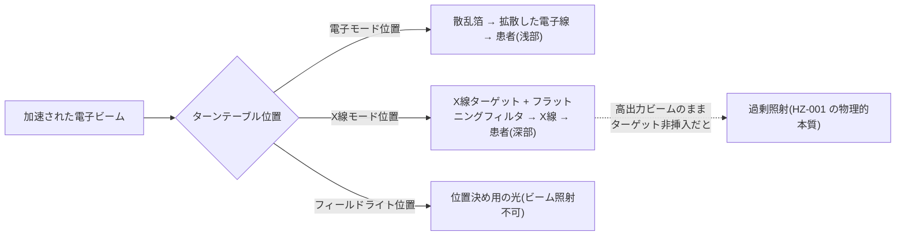
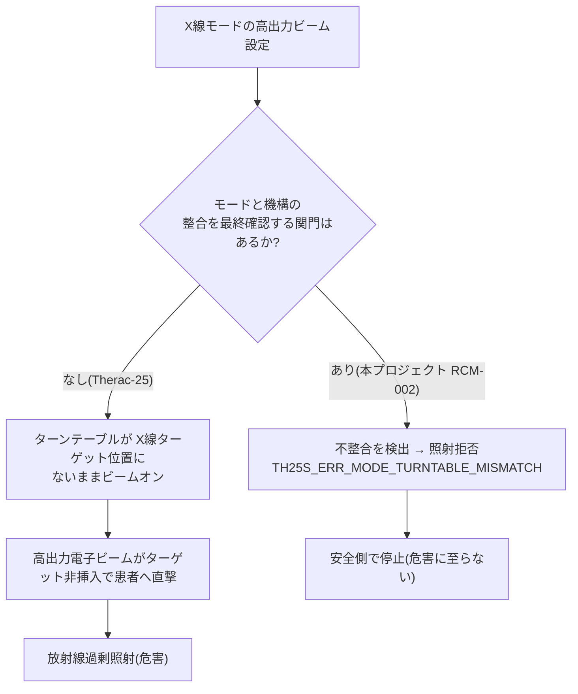
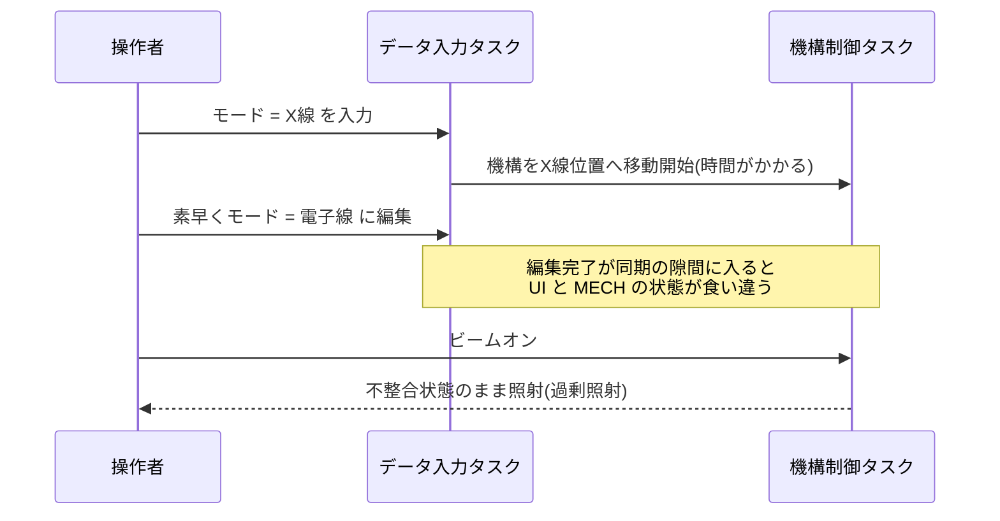
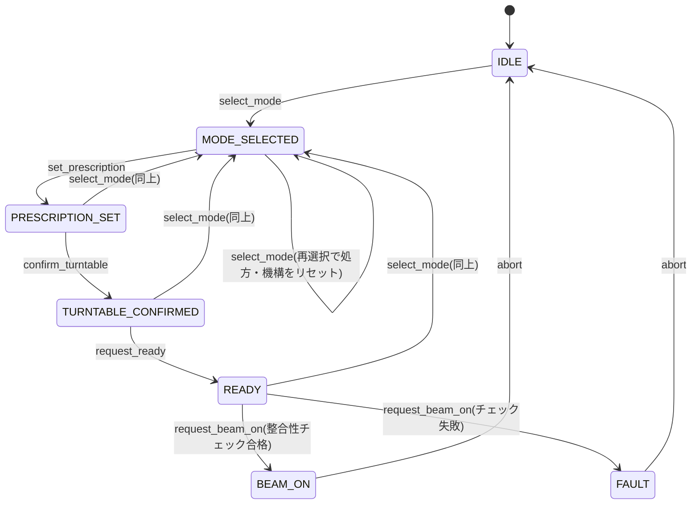
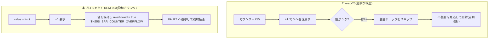
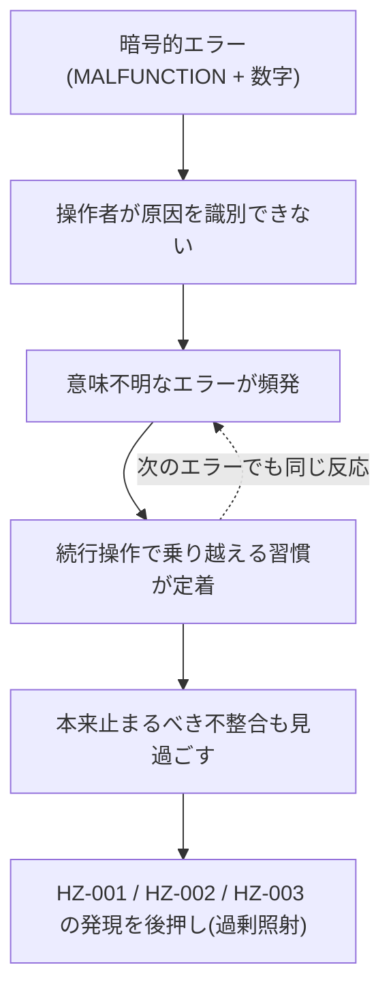
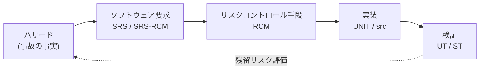

# Therac-25 ハザード解析・事故メカニズム解説

**ドキュメント ID:** HZA-TH25S-001
**バージョン:** 1.0
**作成日:** 2026-05-20
**対象製品:** 仮想 Therac-25 Simple / TH25S-SIM-001
**対象リリース:** 1.0.0

| 役割 | 氏名 | 所属 | 日付 | 署名 |
|------|------|------|------|------|
| 作成者 | 開発者A(全ロール兼任) | 学習プロジェクト | 2026-05-20 | — |
| レビュー者 | 開発者A(全ロール兼任) | 学習プロジェクト | 2026-05-20 | — |
| 承認者 | 開発者A(全ロール兼任) | 学習プロジェクト | 2026-05-20 | — |

---

> **位置づけ:** 本書は **学習プロジェクト固有の補助教材**(文書 ID プレフィックス `HZA-`)であり、IEC 62304 / ISO 14971 が直接要求する成果物ではない。ハザードの正本は [リスクマネジメントファイル(RMF-TH25S-001)](./7_software_risk_management_process/risk_management_file.md) であり、本書はその §4(ハザード)・§6(リスク評価)を **事故発生メカニズムの観点から肉付けする** 解説である。
>
> **出典と免責:** Therac-25 の事故に関する記述は学術文献、特に N. G. Leveson & C. S. Turner, "An Investigation of the Therac-25 Accidents," *IEEE Computer*, vol. 26, no. 7, pp. 18–41, 1993 に基づく事実関係のみを扱う。本リポジトリは学術・教育目的の **再構成(仮想)** であり、当時の AECL 社内文書ではない。個人・企業への責任帰属を断定する表現は避ける。

## 1. 本書の目的と読み方

本書は次の 3 つの問いに答える形で構成している。

1. **何が、どのように起きたのか** — 各ハザードの事故発生メカニズムを、物理(放射線治療装置の仕組み)とソフトウェア(欠陥の構造)の両面から解説する。
2. **IEC 62304 のプロセスを踏めば防げたのか** — 「もし要求分析・アーキテクチャ設計・詳細設計・検証・構成管理が正しく回っていたら、どの活動が事故を断ち切ったか」を各ハザードごとに示す。
3. **ハザードはどうシステム要求になるのか** — 「事故の裏返し」がソフトウェア要求(SRS)・リスクコントロール手段(RCM)・実装・試験へと展開される様子をトレースする(§8)。

> **学習の出発点としてのハザード:** 本プロジェクトのソフトウェア規模(安全コア 1 モジュール・3 ユニット)は、Therac-25 の代表的 3 ハザード(+ 横断要因)から逆算して決められている。つまり **ハザードが事実上のシステム要求の源泉** である。この視点で読むと、なぜこの 3 ユニットなのか、なぜこの API なのかが理解できる。

## 2. Therac-25 の背景

Therac-25 は AECL(Atomic Energy of Canada Limited)が 1982 年に発売したデュアルモード医療用リニアアクセラレータ(線形加速器)である。1985〜1987 年に米国・カナダの複数施設で **計 6 件の放射線過剰照射事故** が発生し、死亡を含む重篤な被害をもたらした。

### 2.1 2 つの治療モード

| モード | 用途 | ビームの作り方 | 概略のビーム電流 |
|--------|------|--------------|----------------|
| 電子線(Electron) | 浅部の腫瘍 | 加速した電子を散乱箔で広げ、直接照射する | 低い |
| X線 / 光子(X-ray) | 深部の腫瘍 | 高出力の電子ビームを **X線ターゲット** に当てて X線へ変換し、フラットニングフィルタで線量分布を均一化する | 電子線モードより桁違いに高い |

両モードのビーム電流の桁違いの差が、本事故の物理的な致命性の根源である。**X線モードの高出力電子ビームが、ターゲット・フィルタを介さずに患者へ直接届くと、想定の数十〜百倍規模の線量となりうる**(Leveson & Turner 1993)。

### 2.2 ターンテーブル — モードと機構を物理的に切り替える要

ビーム経路上の機構は **ターンテーブル**(回転式の切り替え機構)で選択される。本プロジェクトでは [`common_types.h`](./src/th25s_core/include/th25s_core/common_types.h) の `th25s_turntable_position_t` として 3 位置をモデル化している。



### 2.3 なぜソフトウェアが安全の最後の砦になったのか

前身機(Therac-6 / Therac-20)は、モードと機構の不整合を **ハードウェアインターロック**(電気・機械的な連動)で物理的に防いでいた。Therac-25 ではこの安全機能の多くが **ソフトウェアに移管** され、かつ単独に近い体制で開発されて独立したレビューが十分に行われなかったことが、文献で繰り返し指摘されている。

> **本プロジェクトとの対応:** この「単独開発 + 独立レビューの不在」という構造こそ、本リポジトリが [CCB 運用規程](./8_software_configuration_management_process/ccb_operating_rules.md) §3.1 で **独立性の擬制**(審議インターバル・自己レビューチェックリスト・CI による機械的検証)を意図的に導入している動機である。

## 3. ハザード一覧と本書での扱い

| ハザード | 事象シーケンス | 内容 | 本プロジェクトの RCM | 解説節 |
|---------|--------------|------|--------------------|--------|
| [HZ-001](#4-hz-001-モードとターンテーブルの不整合) | EV-001 | モードとターンテーブル位置の不整合状態での照射 | RCM-002(独立インターロック) | §4 |
| [HZ-002](#5-hz-002-操作順序依存race-condition) | EV-002 | 操作順序依存(当時の race condition) | RCM-001(状態機械) | §5 |
| [HZ-003](#6-hz-003-カウンタオーバーフローによる安全チェックのバイパス) | EV-003 | カウンタオーバーフローによる安全チェックのバイパス | RCM-003(飽和カウンタ) | §6 |
| [横断](#7-横断要因-暗号的エラーメッセージ) | EV-004 | 暗号的エラーメッセージによる誤判断・バイパス常態化 | RCM-004(可読メッセージ) | §7 |

各節は **(1) 事故メカニズム → (2) 図解 → (3) IEC 62304 プロセスならどう防げたか → (4) 本プロジェクトの実装** の順で構成する。

## 4. HZ-001: モードとターンテーブルの不整合

### 4.1 事故メカニズム

文献によれば、複数の事故に共通する物理的な発現形は「**X線モードの高出力電子ビームが、ターンテーブルが X線ターゲット位置にない状態で照射される**」ことであった。ターゲットとフラットニングフィルタを介さない高電流の電子ビームが患者に直接到達し、極端な過剰線量をもたらした。

これは個別の操作ミスや単一バグというより、**「モード(ビームの強さ)」と「機構(ビーム経路)」の整合を保証する最終関門が存在しなかった**ことに起因する、装置全体としての設計上のハザードである。

### 4.2 図解(EV-001 の発現経路)



### 4.3 IEC 62304 プロセスならどう防げたか

| プロセス(箇条) | 事故を断ち切りえた活動 |
|----------------|---------------------|
| 要求分析(5.2) | 「モードとターンテーブル位置の整合をビームオン時に確認する」を **明示的なソフトウェア要求**(本プロジェクトの SRS-007)として書き起こす。要求がなければ実装も試験も生まれない。 |
| アーキテクチャ設計(5.3) | 整合判定を、操作シーケンスを管理する主体から **分離した独立コンポーネント** に置く(5.3.5 クラス C の分離要求)。一方が誤っても他方が守る多重防御。 |
| 詳細設計(5.4) | 整合判定を **副作用のない純関数** として設計し、状態汚染による判定不能を排除。 |
| 検証(5.5 / 5.7) | 「不整合状態でビームオンを要求すると拒否される」シナリオをユニット試験・システム試験で確認(本プロジェクトの ST-003)。 |

### 4.4 本プロジェクトの実装(RCM-002)

[`safety_interlock.c`](./src/th25s_core/src/safety_interlock.c) の `th25s_interlock_check_beam_on()` が、シーケンサとは **論理分離**(SEP-001)された独立判定として最終整合性を確認する。この関数は可変なグローバル状態・静的状態を一切持たない純関数である。

```c
/* safety_interlock.c より抜粋 */
if (in->turntable != expected_turntable_for(in->mode)) {
    return TH25S_ERR_MODE_TURNTABLE_MISMATCH;
}
```

- **要求:** SRS-007 / SRS-RCM-002 / **対応ハザード:** HZ-001
- **実装:** UNIT-003 SafetyInterlock(純関数、SEP-001 論理分離)
- **検証:** UT-003-01〜14、ST-003

> シーケンサ側(`th25s_seq_confirm_turntable`)は操作者が確定した位置を **そのまま記録するだけ** で整合判定をしない。整合判定をビームオン時の独立関門に一本化することで、「誤った位置を確定してしまった」場合でも最終段で拒否される多重防御が成立する。

## 5. HZ-002: 操作順序依存(race condition)

### 5.1 事故メカニズム

East Texas Cancer Center(テキサス州タイラー)の事故では、熟練した操作者が処方データを **高速に編集** したことが引き金となった。文献によれば、操作者はモードを一旦設定した後にカーソルを戻して短時間でモードを編集し直した。当時のソフトウェアは複数のタスク(データ入力処理と機構制御)が並行しており、**編集の完了タイミングがタスク間のデータ同期の隙間に入り込むと、画面上のモード設定と実際の機構状態が食い違ったまま照射に至る** 競合状態(race condition)が存在した。

### 5.2 図解 — 当時の競合と、本プロジェクトの状態機械

当時のタイミング競合(概念図):



本プロジェクトは **並行処理を導入せず**、競合を **単一スレッドの操作順序依存バグ** として状態機械で教材化している(CLAUDE.md 方針)。正しい状態遷移は次の通り。



**鍵となる設計:** モードを(再)選択すると、処方とターンテーブル確定を **すべて破棄して `MODE_SELECTED` へ戻す**。これにより「設定完了後に素早くモードを編集すると古い機構状態が引き継がれる」経路を、状態機械の構造そのものが不可能にする。

### 5.3 IEC 62304 プロセスならどう防げたか

| プロセス(箇条) | 事故を断ち切りえた活動 |
|----------------|---------------------|
| 要求分析(5.2) | 「操作は定められた順序でのみ進行し、逸脱は拒否する」「モード再選択時は下流の確定を破棄する」を要求化(SRS-002 / SRS-003 / SRS-004)。 |
| アーキテクチャ設計(5.3) | 暗黙のフラグ共有ではなく、**明示的な状態機械** を中心構造に据える。状態を単一の真実の源とし、競合の温床を構造的に排除。 |
| 詳細設計(5.4) | 各操作関数の **事前条件(許可される現在状態)** を明文化し、逸脱時のエラーを定義。 |
| 検証(5.5 / 5.7) | 「設定後にモードを編集した後、確定をやり直さずにビームオンを要求すると拒否される」シナリオを試験(ST-004)。 |

### 5.4 本プロジェクトの実装(RCM-001)

[`treatment_sequencer.c`](./src/th25s_core/src/treatment_sequencer.c) の状態機械が操作順序を構造的に強制する。

```c
/* treatment_sequencer.c: th25s_seq_select_mode より抜粋 */
seq->rx.mode = mode;
seq->rx.energy = 0.0;
seq->rx.dose_cgy = 0.0;
seq->turntable = TH25S_TT_UNKNOWN;       /* 下流の確定を破棄 */
seq->state = TH25S_SEQ_MODE_SELECTED;     /* MODE_SELECTED へ戻す */
```

各 `th25s_seq_*()` 関数は現在状態を検査し、許可されない遷移には `TH25S_ERR_SEQUENCE_VIOLATION` を返す。

- **要求:** SRS-002 / SRS-003 / SRS-004 / SRS-RCM-001 / **対応ハザード:** HZ-002
- **実装:** UNIT-002 TreatmentSequencer(明示的状態機械、単一スレッド)
- **検証:** UT-002-03〜08, 16, 20、ST-004

## 6. HZ-003: カウンタオーバーフローによる安全チェックのバイパス

### 6.1 事故メカニズム

ワシントン州ヤキマの事故では、セットアップのたびにインクリメントされる **1 バイト幅のカウンタ** が関与したと文献は述べている。このカウンタが上限(255)を超えて **0 へ巻き戻る(オーバーフローする)瞬間** に、機構の整合性を確認するチェックが **スキップされる** 経路が存在した。操作者がちょうどその瞬間に照射操作を行うと、整合チェックを経ないまま照射に至った。

ここでの教訓は鋭い。**「カウンタの値が特定の値になったら安全チェックを省略する」という構造そのものが危険** だという点である。オーバーフローは「いつか必ず起きる」前提で設計しなければならない。

### 6.2 図解 — 巻き戻るカウンタ vs 飽和カウンタ



### 6.3 IEC 62304 プロセスならどう防げたか

| プロセス(箇条) | 事故を断ち切りえた活動 |
|----------------|---------------------|
| 要求分析(5.2) | 「整合性チェックの計数がオーバーフローした場合はビームオンを拒否する」を要求化(SRS-009)。 |
| 詳細設計(5.4) | カウンタを **飽和カウンタ**(上限で停止し巻き戻らない)として設計。安全チェックの実施可否を「カウンタ値」に依存させない。 |
| 共通欠陥の回避(5.1.12 — クラス B, C) | 整数オーバーフローは既知の共通ソフトウェア欠陥であり、回避を計画段階で要求(SDP §14)。 |
| 検証(5.5 / 5.7) | 上限到達時に拒否されること、巻き戻りが起きないことを境界値試験で確認(UT-001-14〜19、ST-005)。 |

### 6.4 本プロジェクトの実装(RCM-003)

[`common_types.c`](./src/th25s_core/src/common_types.c) の飽和カウンタは、上限到達時に 0 へ巻き戻さず値を保持してエラーを返す。

```c
/* common_types.c: th25s_safe_counter_increment より抜粋 */
if (counter->value >= counter->limit) {
    counter->overflowed = true;
    return TH25S_ERR_COUNTER_OVERFLOW;   /* 巻き戻らない */
}
counter->value++;
```

[`treatment_sequencer.c`](./src/th25s_core/src/treatment_sequencer.c) の `th25s_seq_request_beam_on()` は、カウンタのオーバーフロー時に **照射を省略するのではなく FAULT へ遷移して拒否** する。

- **要求:** SRS-009 / SRS-RCM-003 / **対応ハザード:** HZ-003
- **実装:** UNIT-001 CommonTypes(飽和カウンタ)+ UNIT-002 TreatmentSequencer(FAULT 遷移)
- **検証:** UT-001-14〜19, UT-002-17、ST-005

## 7. 横断要因: 暗号的エラーメッセージ

### 7.1 事故メカニズム

Therac-25 は異常時に "MALFUNCTION" の語と数字コード(例として広く知られる "Malfunction 54")だけを表示し、操作マニュアルにもコードの意味が十分に記載されていなかったと文献は指摘する。操作者は日常的に多数の "Malfunction" に遭遇しており、内容を確認せずに **続行操作で乗り越える運用習慣** が定着していた。この習慣が、本来止まるべき異常を見過ごす土壌となり、上記 3 ハザードのいずれの発現も後押しした。

### 7.2 図解 — バイパス習慣の悪循環



### 7.3 IEC 62304 プロセスならどう防げたか

| プロセス(箇条) | 事故を断ち切りえた活動 |
|----------------|---------------------|
| 要求分析(5.2) | 「すべてのエラーはコードと **人間可読のメッセージ** を伴って通知する」を要求化(SRS-010)。 |
| 詳細設計(5.4) | 全エラーコードへのメッセージ対応付けを **網羅的に** 定義(抜けがあれば既定メッセージで縮退)。 |
| 検証(5.5) | 全エラーコードに対しメッセージが返ることを試験(UT-001-20, 21)。 |

> **位置づけの注意:** RCM-004(明確なエラー表示)は ISO 14971 の優先順位では「安全に関する情報(警告)」に分類され、設計による本質的安全(RCM-001〜003)より **優先度が低い補助的手段** である。情報提供だけでは事故は防ぎきれないため、本質的安全と **併用** してはじめて有効になる(RMF §6.2、[IEC62304_QA.md §QA-001](./IEC62304_QA.md#qa-001-rmf-61-リスク評価コントロール一覧の見方))。

### 7.4 本プロジェクトの実装(RCM-004)

[`common_types.c`](./src/th25s_core/src/common_types.c) の `th25s_error_message()` が全エラーコードに人間可読メッセージを対応付け、`default` で未定義コードも縮退表示する(NULL を返さない)。

- **要求:** SRS-010 / SRS-RCM-004 / **対応ハザード:** HZ-001 / HZ-002 / HZ-003(横断)
- **実装:** UNIT-001 CommonTypes
- **検証:** UT-001-20, UT-001-21

## 8. ハザードをシステム要求として読む

Issue #3 の指摘「Therac-25 のハザードがプロジェクトのシステム要求とも考えられる」は、本プロジェクトの設計思想そのものである。**事故の裏返し**が要求・コントロール・実装・試験へと一直線にトレースされる。



| ハザード | → ソフトウェア要求 | → RCM | → 実装(UNIT) | → 検証 |
|---------|------------------|-------|--------------|--------|
| HZ-001 | SRS-005, SRS-007, SRS-008 / SRS-RCM-002 | RCM-002 | UNIT-003 SafetyInterlock | UT-003-01〜14, ST-003 |
| HZ-002 | SRS-002, SRS-003, SRS-004 / SRS-RCM-001 | RCM-001 | UNIT-002 TreatmentSequencer | UT-002-03〜08, ST-004 |
| HZ-003 | SRS-009 / SRS-RCM-003 | RCM-003 | UNIT-001 + UNIT-002 | UT-001-14〜19, ST-005 |
| 横断 | SRS-010 / SRS-RCM-004 | RCM-004 | UNIT-001 CommonTypes | UT-001-20, 21 |

この対応関係の正本は [SRS §5・§9](./5.2_software_requirements_analysis/software_requirements_specification.md)、[RMF §11](./7_software_risk_management_process/risk_management_file.md) のトレーサビリティマトリクスである。

## 9. まとめ — IEC 62304 のどの活動が効いたか

「IEC 62304 のプロセスが正しく回っていたら事故を防げたか」への本プロジェクトの回答を、フェーズ別に整理する。

| フェーズ | 事故防止に最も寄与しえた活動 | 本プロジェクトでの現れ |
|---------|---------------------------|---------------------|
| リスクマネジメント(7) | ハザードの体系的識別と、事象シーケンスの文書化 | RMF §4(HZ / EV)、SRMP |
| 要求分析(5.2) | ハザードを打ち消す要求の明文化(事故の裏返し) | SRS-002〜010、SRS-RCM-001〜004 |
| アーキテクチャ設計(5.3) | 安全機能の分離(クラス C の 5.3.5) | SafetyInterlock の論理分離(SEP-001) |
| 詳細設計(5.4) | 状態機械・純関数・飽和カウンタによる本質的安全 | UNIT-001〜003 |
| 実装(5.5) | 危険な構造(巻き戻り・暗黙フラグ・暗号的エラー)の排除 | `src/th25s_core/` |
| 検証(5.5 / 5.6 / 5.7) | 異常系・境界値・RCM 有効性の試験 | UT / IT / ST |
| 構成管理・問題解決(8 / 9) | 単独開発下の独立性擬制(レビュー不在の補完) | CCB 審議インターバル、CI 機械的検証 |

> **最大の教訓:** 単一の関門に頼らず、**設計の各段で危険状態を構造的に成立させない**(本質的安全を多重に積む)こと。RCM-001(順序の強制)・RCM-002(独立した整合判定)・RCM-003(巻き戻らないカウンタ)は、いずれも「人間が正しく操作すれば安全」ではなく「**誤って操作しても危険状態に到達できない**」設計を志向している。これが Therac-25 の事故が現代に残した最も重い示唆である。

## 10. 参照文書・文献

| 種別 | 文書 |
|------|------|
| ハザードの正本 | [リスクマネジメントファイル(RMF-TH25S-001)](./7_software_risk_management_process/risk_management_file.md) |
| 要求 | [ソフトウェア要求仕様書(SRS-TH25S-001)](./5.2_software_requirements_analysis/software_requirements_specification.md) |
| アーキテクチャ | [ソフトウェアアーキテクチャ設計書(SAD-TH25S-001)](./5.3_software_architecture_design/software_architecture_design.md) |
| 詳細設計 | [ソフトウェア詳細設計書(SDD-TH25S-001)](./5.4_software_detailed_design/software_detailed_design.md) |
| 実装 | [`src/th25s_core/`](./src/th25s_core/) |
| Q&A | [IEC62304_QA.md](./IEC62304_QA.md) |
| 学術文献 | N. G. Leveson & C. S. Turner, "An Investigation of the Therac-25 Accidents," *IEEE Computer*, vol. 26, no. 7, pp. 18–41, 1993 |

## 11. 改訂履歴

| バージョン | 日付 | 変更内容 | 変更者 |
|----------|------|---------|--------|
| 1.0 | 2026-05-20 | 初版作成(CR-0008、Issue #3)。HZ-001〜003 + 横断要因の事故発生メカニズムを Mermaid 図解付きで解説。各ハザードに「IEC 62304 プロセスでの防止」「本実装の RCM 対応」を対応付け、§8 でハザード → 要求 → RCM → 実装 → 検証のトレースを明示。 | 開発者A |
