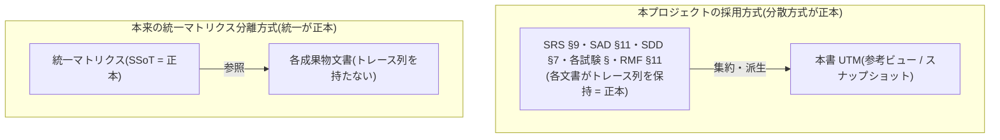

# 統一トレーサビリティマトリクス(Unified Traceability Matrix)

**ドキュメント ID:** UTM-TH25S-001
**バージョン:** 1.1
**作成日:** 2026-05-20
**対象製品:** 仮想 Therac-25 Simple / TH25S-SIM-001
**対象ベースライン:** BL-20260520-015(CR-0012 是正後のスナップショット)

| 役割 | 氏名 | 所属 | 日付 | 署名 |
|------|------|------|------|------|
| 作成者 | 開発者A(全ロール兼任) | 学習プロジェクト | 2026-05-20 | — |
| レビュー者 | 開発者A(全ロール兼任) | 学習プロジェクト | 2026-05-20 | — |
| 承認者 | 開発者A(全ロール兼任) | 学習プロジェクト | 2026-05-20 | — |

---

> **⚠️ 位置づけ(最重要):本書は参考資料であり、正本ではない。**
> 本プロジェクトのトレーサビリティの **正本(Single Source of Truth)は各成果物文書の §トレーサビリティ列(分散方式)** である(SRS §9 / SAD §11 / SDD §7 / UTPR §10 / ITPR §13 / STPR §11 / RMF §11)。本書はそれらを **単一ビューに集約した派生(二次情報・スナップショット)** にすぎない。本書と各文書が食い違った場合は **各文書を正とする**。
>
> 本書は [`IEC62304_QA.md` QA-002 §5](./IEC62304_QA.md#5-別の運用パターン参考統一トレーサビリティマトリクスの分離) で言及した **「統一トレーサビリティマトリクスの分離方式」の参考実装** として、Issue #4(CR-0009)で作成された。

## 1. 本書の目的と「正本の方向」について

### 1.1 目的

V 字モデルの全レイヤを縦断するトレース(要求 → アーキテクチャ → 詳細設計 → 実装 → ユニット試験 → 結合試験 → システム試験)と、安全レイヤのトレース(ハザード → 事象 → リスクコントロール手段 → 実装 → 検証)を、**1 つの文書から俯瞰** できるようにする。各文書を個別に開かなくても全体の整合性・網羅性を一望できることが、統一マトリクスの利点である。

### 1.2 「正本の方向」— 本書が分散方式と逆である点(教材上の核心)

QA-002 §5 が説明する本来の **「統一マトリクス分離方式」では、統一マトリクスこそが SSoT(単一情報源)** であり、各成果物文書はトレース列を持たず本マトリクスを参照する。しかし **本プロジェクトは分散方式(各文書がトレース列を持つ)を正本として採用** しているため、Issue #4 の制約「現在のトレーサビリティマトリクスは変更しない」に従い、本書は **各文書から導出される派生ビュー** という逆の位置づけになる。

**したがって本書の運用上の注意:** 本書は特定ベースライン(`BL-20260520-012`)時点のスナップショットである。各成果物文書のトレース列が更新された場合、**本書は自動では追従しない** ため、更新の都度この派生ビューを再生成する必要がある(これは分散方式の既知の欠点「多重管理コスト」が、本書の存在によってもう一段増えることを意味する)。実プロジェクトで統一方式を本採用する場合は、上図 UNI のように正本を反転させ、各文書側のトレース列を撤去するのが筋である。

## 2. 凡例と出典

### 2.1 各列の正本文書(出典)

| 列 | 正本文書(§トレース列) |
|----|----------------------|
| SRS ID・要求概要 | [SRS §4](./5.2_software_requirements_analysis/software_requirements_specification.md#4-ソフトウェア要求事項箇条-522) |
| アーキテクチャ(ARCH) | [SAD §11](./5.3_software_architecture_design/software_architecture_design.md#11-トレーサビリティマトリクス) / [SRS §9](./5.2_software_requirements_analysis/software_requirements_specification.md#9-トレーサビリティマトリクス箇条-526) |
| 詳細設計 / ユニット(UNIT) | [SDD §7](./5.4_software_detailed_design/software_detailed_design.md#7-トレーサビリティマトリクス) |
| ユニット試験(UT) | [UTPR §10](./5.5_software_unit_implementation/software_unit_test_plan_report.md#10-トレーサビリティマトリクス) |
| 結合試験(IT) | [ITPR §13](./5.6_software_integration_testing/software_integration_test_plan_report.md#13-トレーサビリティマトリクス) |
| システム試験(ST) | [STPR §11](./5.7_software_system_testing/software_system_test_plan_report.md#11-トレーサビリティマトリクスsrs-網羅性) |
| ハザード(HZ)・事象(EV)・RCM | [RMF §11](./7_software_risk_management_process/risk_management_file.md#11-トレーサビリティ) / [RMF §4・§6](./7_software_risk_management_process/risk_management_file.md#4-ハザードハザード状況危害の識別iso-14971-箇条-54) |

### 2.2 アーキテクチャ項目(ARCH-001 の内訳)

ARCH-001(TH25S-CORE 安全コア `libth25s_core.a`)は 3 ユニットに対応する。

| ARCH 項目 | ユニット | 役割 |
|-----------|---------|------|
| ARCH-001.1 | UNIT-001 CommonTypes | 共通型・モード別範囲検証・飽和カウンタ・エラーメッセージ |
| ARCH-001.2 | UNIT-002 TreatmentSequencer | 治療シーケンス状態機械(操作順序の構造的強制) |
| ARCH-001.3 | UNIT-003 SafetyInterlock | ビーム照射可否の独立した最終整合性判定(純関数、SEP-001 論理分離) |

## 3. 要求駆動トレーサビリティ(縦糸:SRS → 実装 → 検証)

> **出典:** SRS §9 + SDD §7 + UTPR §10 + ITPR §13 + STPR §11 を集約。IT 列は ITPR §13 に直接マッピングがある要求のみ記載(結合試験はボトムアップで主要シナリオのみを対象とするため空欄の要求がある)。

| SRS ID | 要求概要 | ARCH | UNIT | UT(ユニット試験) | IT(結合試験) | ST(システム試験) | 関連 RCM / HZ |
|--------|---------|------|------|------------------|--------------|------------------|--------------|
| SRS-001 | 治療モード(電子 / X線)を選択できる | ARCH-001.2 | UNIT-002 | UT-002-02 | IT-001 | ST-001, ST-002 | — |
| SRS-002 | 治療シーケンスは定められた順序でのみ進行し逸脱を拒否 | ARCH-001.2 | UNIT-002 | UT-002-03〜06 | — | ST-004 | RCM-001 / HZ-002 |
| SRS-003 | モード再選択時に処方・ターンテーブル確定を破棄 | ARCH-001.2 | UNIT-002 | UT-002-07, UT-002-08 | — | ST-004 | RCM-001 / HZ-002 |
| SRS-004 | ビームオン要求は READY 状態でのみ受付 | ARCH-001.2 | UNIT-002 | UT-002-04, UT-002-06 | — | ST-001 | RCM-001 |
| SRS-005 | エネルギをモード別許容範囲で検証し範囲外を拒否 | ARCH-001.1, ARCH-001.3 | UNIT-001, UNIT-003 | UT-001-01〜08, UT-003-08 | IT-005, IT-006 | ST-006 | RCM-002 |
| SRS-006 | ターンテーブル位置を確定できる | ARCH-001.2 | UNIT-002 | UT-002-12 | — | ST-001, ST-002 | — |
| SRS-007 | モードとターンテーブル整合をシーケンサから独立に判定し不整合を拒否 | ARCH-001.3 | UNIT-003 | UT-003-01〜06, UT-002-13, UT-002-14 | IT-002, IT-003 | ST-003 | RCM-002 / HZ-001 |
| SRS-008 | 線量を許容範囲で検証し範囲外を拒否 | ARCH-001.1, ARCH-001.3 | UNIT-001, UNIT-003 | UT-001-09〜13, UT-003-09 | IT-005, IT-006 | ST-006 | RCM-002 |
| SRS-009 | 整合性チェック計数のオーバーフロー時にビームオンを拒否 | ARCH-001.1, ARCH-001.2 | UNIT-001, UNIT-002 | UT-001-14〜19, UT-002-17 | IT-004 | ST-005 | RCM-003 / HZ-003 |
| SRS-010 | 全エラーをコード + 人間可読メッセージで通知 | ARCH-001.1 | UNIT-001 | UT-001-20, UT-001-21 | — | ST-007 | RCM-004 |
| SRS-101 | ビームオン整合性判定は同期完了し戻り値で結果返却(性能) | ARCH-001.2, ARCH-001.3 | UNIT-002, UNIT-003 | UT-002-02, UT-003-01 | IT-001 | ST-001 | — |

> **【是正済み】SRS-004 の正本間不整合(CR-0009 で検出 → CR-0012 / [Issue #11](https://github.com/grace2riku/virtual_therac-25_classC_simple/issues/11) で是正):** 本統一マトリクスの作成(CR-0009)時点では、SRS-004 のシステム試験 ID が [SRS §9](./5.2_software_requirements_analysis/software_requirements_specification.md#9-トレーサビリティマトリクス箇条-526)(`ST-004`)と [STPR §11](./5.7_software_system_testing/software_system_test_plan_report.md#11-トレーサビリティマトリクスsrs-網羅性)(`ST-001`)で食い違っていた。CR-0012 で **ST-001 を正**として SRS §9 を是正し、さらに [STPR §8](./5.7_software_system_testing/software_system_test_plan_report.md#8-試験ケース定義) の ST-001 カバー要求にも SRS-004 を補完して、**SRS §9 / STPR §8 / STPR §11 の 3 者を ST-001 で完全整合**させた。**統一ビューが分散方式の隠れた不整合を検出し、是正につながった実例** である。

## 4. 安全駆動トレーサビリティ(ハザード → RCM → 実装 → 検証)

> **出典:** RMF §4(HZ / EV)+ RMF §6(RCM / コントロール種別)+ RMF §7(RCM 検証 ID)+ RMF §11(実装・検証)+ SRS §5(SRS-RCM)+ ITPR §13 + STPR §11 を集約。横断行(EV-004 / RCM-004)は RMF §6.1 に基づく(RMF §11 は主要 3 ハザードのみ計上)。UT 列は RMF §7.1(RCM 別の検証 ID)に準拠するため RMF §11 より網羅的(例: HZ-002 は UT-002-16, UT-002-20 を含む)。

| HZ | EV | SRS-RCM | RCM | コントロール種別 | 実装(UNIT / ソース) | UT | IT | ST |
|----|-----|---------|-----|----------------|---------------------|----|----|----|
| HZ-001 | EV-001 | SRS-RCM-002 | RCM-002 | 設計安全(独立整合判定) | UNIT-003 / `safety_interlock.c` | UT-003-01〜14, UT-002-13, UT-002-14 | IT-002, IT-003 | ST-003 |
| HZ-002 | EV-002 | SRS-RCM-001 | RCM-001 | 設計安全(状態機械) | UNIT-002 / `treatment_sequencer.c` | UT-002-03〜08, UT-002-16, UT-002-20 | — | ST-004 |
| HZ-003 | EV-003 | SRS-RCM-003 | RCM-003 | 設計安全(飽和カウンタ) | UNIT-001, UNIT-002 / `common_types.c`, `treatment_sequencer.c` | UT-001-14〜19, UT-002-17 | IT-004 | ST-005 |
| HZ-001 / HZ-002 / HZ-003(横断) | EV-004 | SRS-RCM-004 | RCM-004 | 警告(可読エラー表示) | UNIT-001 / `common_types.c` | UT-001-20, UT-001-21 | — | ST-007 |

> 各ハザードの事故発生メカニズムの詳細は [`THERAC25_HAZARD_ANALYSIS.md`](./THERAC25_HAZARD_ANALYSIS.md)、残留リスク評価は [RMF §6.1](./7_software_risk_management_process/risk_management_file.md#61-リスク評価コントロール一覧) を参照(全行が RCM 適用後に「S5 × P1 = 中」へ収束)。

## 5. リスクコントロール手段の対応(RCM → SRS-RCM → アーキテクチャ → 実装)

> **出典:** SRS §5 + SAD §11 + RMF §6.2(優先順位)。

| RCM | SRS-RCM | 対応 HZ | アーキテクチャ | 実装 UNIT | ISO 14971 §7.1 優先順位 |
|-----|---------|---------|--------------|----------|------------------------|
| RCM-001 | SRS-RCM-001 | HZ-002 | ARCH-001.2 | UNIT-002 | ① 設計安全(主たる) |
| RCM-002 | SRS-RCM-002 | HZ-001 | ARCH-001.3(SEP-001 論理分離) | UNIT-003 | ① 設計安全(主たる)+ 多重防御 |
| RCM-003 | SRS-RCM-003 | HZ-003 | ARCH-001.1, ARCH-001.2 | UNIT-001, UNIT-002 | ① 設計安全(主たる) |
| RCM-004 | SRS-RCM-004 | HZ-001 / HZ-002 / HZ-003(横断) | ARCH-001.1 | UNIT-001 | ③ 警告(補助的) |

## 6. カバレッジ・サマリ

本書作成時点(`BL-20260520-012`)での網羅性を集計する。

| 観点 | 結果 |
|------|------|
| 機能要求(SRS-001〜010, 101 計 11 件)の試験網羅 | **全 11 件** がユニット試験(UT)とシステム試験(ST)で検証・合格(STPR §11 で全 SRS 網羅を確認) |
| 結合試験(IT)で直接検証された要求 | SRS-001, SRS-005, SRS-007, SRS-008, SRS-009, SRS-101(主要シナリオ。ITPR §13) |
| ハザード(HZ-001〜003 + 横断)の RCM 割当 | **全 4 事象**(EV-001〜004)に RCM-001〜004 を割当(RMF §6.1) |
| RCM(RCM-001〜004)の実装・検証 | **全 4 件** が UNIT 実装 + UT/ST で検証(RMF §7) |
| 残留リスク | 全行が RCM 適用後「中(S5 × P1)」へ収束、許容(RMF §6.1 / §8) |
| 上流 → 下流トレース | SRS → ARCH → UNIT → UT/IT/ST が全要求で成立 |
| 下流 → 上流トレース | UT/IT/ST → SRS / RCM → HZ が逆引き可能(UTPR §10 / ITPR §13 が逆引きビューを提供) |

> **孤立(orphan)・欠落の有無:** RCM を持たない安全要求、試験を持たない機能要求、要求にトレースしない試験は **いずれも存在しない**(全要求が試験へ、全ハザードが RCM へ双方向に到達可能)。
>
> **検出された正本間不整合(是正済み):** 本統一ビューの作成過程で **1 件** 検出した — SRS-004 のシステム試験 ID が SRS §9(`ST-004`)と STPR §11(`ST-001`)で食い違っていた(§3 の注記参照)。**CR-0012 / [Issue #11](https://github.com/grace2riku/virtual_therac-25_classC_simple/issues/11) で ST-001 を正として是正済み**(SRS §9 を ST-001 に修正し、STPR §8 の ST-001 カバー要求にも SRS-004 を補完。SRS §9 / STPR §8 / STPR §11 が完全整合)。これは「分散方式で各文書が個別にトレース列を持つことの欠点(多重管理による不整合)」を統一ビューが検出し、是正につなげた好例である。

## 7. 分散方式 vs 統一方式 — 本書の位置づけ詳説

[QA-002 §5](./IEC62304_QA.md#5-別の運用パターン参考統一トレーサビリティマトリクスの分離) の対比を、本書という具体物に即して再掲する。

| 観点 | 本プロジェクト採用:分散方式(各文書に §トレース列) | 統一マトリクス分離方式(本書を SSoT 化した場合) |
|------|------------------------------------------------|----------------------------------------------|
| 正本(SSoT) | 各成果物文書のトレース列 | 統一マトリクス 1 枚 |
| 本書の役割 | **派生ビュー(参考・スナップショット)** | **正本** |
| 文書単独の自己完結性 | 高い(監査時に文書だけ追えば完結) | 低い(各文書から本書を参照する必要) |
| 更新時の整合維持 | 文書間で同情報を多重管理(コスト高) | 1 箇所更新で済む(コスト低) |
| 小規模・学習用途への適合 | ◎(本プロジェクトが採用) | △(参照の手間が学習の妨げになりうる) |
| 大規模・多人数への適合 | △(多重管理が破綻しやすい) | ◎(産業界の大規模 PJ で一般的) |

**本プロジェクトでの結論:** 規模が小さく「各文書が自己完結して読める」ことを学習上重視するため **分散方式を正本** とし、統一ビューは本書のような **参考資料** として併設する。本書を SSoT に昇格させ各文書のトレース列を撤去する判断は、本プロジェクトの規模では行わない(行うと学習用のお手本としての各文書の自己完結性が失われる)。

## 8. 参照文書

| 種別 | 文書 |
|------|------|
| 統一方式の解説(本書の発端) | [`IEC62304_QA.md` QA-002 §5](./IEC62304_QA.md#5-別の運用パターン参考統一トレーサビリティマトリクスの分離) |
| 要求(正本) | [SRS-TH25S-001](./5.2_software_requirements_analysis/software_requirements_specification.md) §4 / §5 / §9 |
| アーキテクチャ(正本) | [SAD-TH25S-001](./5.3_software_architecture_design/software_architecture_design.md) §11 |
| 詳細設計(正本) | [SDD-TH25S-001](./5.4_software_detailed_design/software_detailed_design.md) §7 |
| ユニット試験(正本) | [UTPR-TH25S-001](./5.5_software_unit_implementation/software_unit_test_plan_report.md) §10 |
| 結合試験(正本) | [ITPR-TH25S-001](./5.6_software_integration_testing/software_integration_test_plan_report.md) §13 |
| システム試験(正本) | [STPR-TH25S-001](./5.7_software_system_testing/software_system_test_plan_report.md) §11 |
| リスク(正本) | [RMF-TH25S-001](./7_software_risk_management_process/risk_management_file.md) §4 / §6 / §11 |
| ハザード解説 | [THERAC25_HAZARD_ANALYSIS.md](./THERAC25_HAZARD_ANALYSIS.md) |

## 9. 改訂履歴

| バージョン | 日付 | 変更内容 | 変更者 |
|----------|------|---------|--------|
| 1.0 | 2026-05-20 | 初版作成(CR-0009、Issue #4)。QA-002 §5 の統一マトリクス分離方式の参考実装として、要求駆動(§3)・安全駆動(§4)・RCM 対応(§5)の複合トレーサビリティを各文書から集約。本書は派生ビュー(参考資料)であり正本は各文書である旨を §1 で明示。`BL-20260520-012` 時点のスナップショット。作成過程で SRS-004 のシステム試験 ID の正本間不整合(SRS §9 = ST-004 / STPR §11 = ST-001)を検出し §3 ※1・§6 に注記、是正は Issue #11 を起票(PR #10 レビュー指摘 5.1 反映)。 | 開発者A |
| 1.1 | 2026-05-20 | CR-0012(Issue #11)反映: 検出した SRS-004 不整合が ST-001 を正として是正された(SRS §9 を ST-001 に修正、STPR §8 にも SRS-004 を補完)ことを受け、§3 SRS-004 行の ※1 マーカーを除去して `ST-001` に確定、§3 注記・§6 サマリを「是正済み」に更新。`BL-20260520-015` 時点のスナップショットに更新。トレース集約内容は是正後の正本に同期。 | 開発者A |
